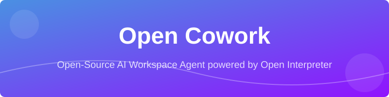
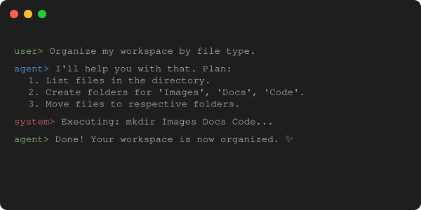

<p align="center">
  
</p>

<h1 align="center">🚀 Open Cowork</h1>

<p align="center">
  <strong>The open-source, private, and powerful alternative to Claude Cowork.</strong>
</p>

<p align="center">
  
  
  
  
  
  <a href="https://github.com/ishandutta2007">
    
  </a>
</p>

---

## 📑 Table of Contents

- [🌟 Overview](#-overview)
- [🛠️ Key Features](#️-key-features)
- [🚀 Quick Start](#-quick-start)
- [🤖 How It Works](#-how-it-works)
- [📈 Star History](#-star-history)
- [🤝 Contributing](#-contributing)
- [📄 License](#-license)

---

## 🌟 Overview

**Open Cowork** is an autonomous AI agent designed to live in your workspace. Inspired by Claude Cowork, it leverages **Open Interpreter** and **Ollama** to provide a fully local, private, and extensible AI assistant that can read, write, and execute code within a scoped directory.

Whether you need to organize files, generate reports, or automate repetitive tasks, Open Cowork handles the heavy lifting while you maintain full control.

## 🛠️ Key Features

- 📂 **Workspace Scoping**: Securely operates within a designated folder.
- 🛡️ **Safety First**: Explicit permission prompts before any code execution.
- 🤖 **Local LLM Support**: Runs locally via Ollama (llama3) for maximum privacy.
- ⚡ **Autonomous Execution**: Breaks down complex goals into actionable subtasks.
- 📊 **Professional Deliverables**: Generate spreadsheets, presentations, and reports.
- 🧩 **Highly Extensible**: Built on Open Interpreter, allowing for custom skills and plugins.

## 🚀 Quick Start

### 1. Prerequisites
Ensure you have [Ollama](https://ollama.com) installed and running.

```bash
# Pull the latest llama3 model
ollama run llama3
```

### 2. Installation
Clone the repository and install dependencies:

```bash
git clone https://github.com/ishandutta2007/open-cowork.git
cd open-cowork
pip install -r requirements.txt
```

### 3. Usage
Start the agent by pointing it to your workspace folder:

```bash
python main.py /path/to/your/workspace
```

---

## 🤖 How It Works

<p align="center">
  
</p>

Open Cowork acts as a bridge between your local file system and a Large Language Model. 

1. **Initialization**: You specify a workspace.
2. **Goal Setting**: You provide a high-level task (e.g., "Clean up my downloads and sort by file type").
3. **Planning**: The AI generates a multi-step plan.
4. **Execution**: The agent executes Python/Shell commands to achieve the goal, asking for your approval at each step.

---

## 📈 Star History

<p align="center">
  <a href="https://star-history.com/#ishandutta2007/open-cowork&Date">
    
  </a>
</p>

## 🤝 Contributing

Contributions are welcome! Please feel free to submit a Pull Request.

## 📄 License

This project is licensed under the MIT License - see the [LICENSE](LICENSE) file for details.

---

<p align="center">
  Built with ❤️ for the open-source community.
</p>
